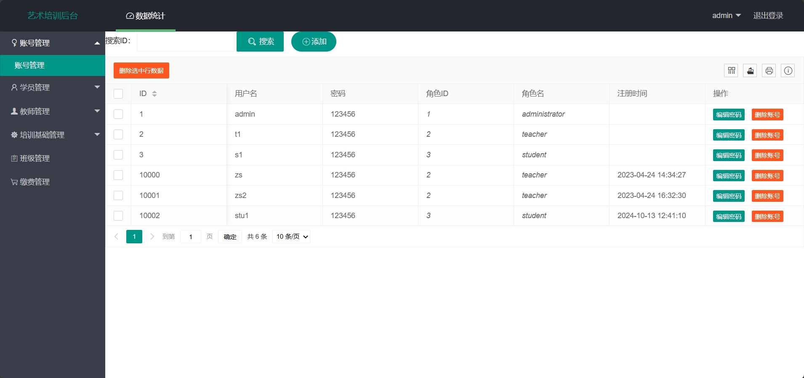

# 艺术培训学校管理系统(文末免费领取☟)
> 
#### 介绍
艺术培训学校管理系统
有BUG可留言加微

#### 软件架构
Java + SSM（Spring+SpringMVC+Mybatis） + Mysql

#### 项目功能说明

1.  管理员功能
> + 数据统计
> + 账号管理
> + 学员信息管理
> + 教师信息管理
> + 培训基础管理：课程管理、教室管理
> + 班级管理
> + 缴费管理
2.  教师功能
> + 班级管理：开设班级，报名管理
> + 通知管理
> + 成绩管理
> + 个人信息管理
2.  学生功能
> + 登录注册
> + 课程中心、班级报名
> + 通知展示
> + 班级信息查看
> + 成绩查看、成绩导出
> + 个人中心：查看订单、修改个人信息

### 部分功能演示

### 环境需求(可免费提供)
- idea/eclipse、jdk-1.8、maven-3.8.6、mysql、nodejs等

## 有项目修改、安装调试需求 请联系以下

## 获取资源扫☝☝☝
